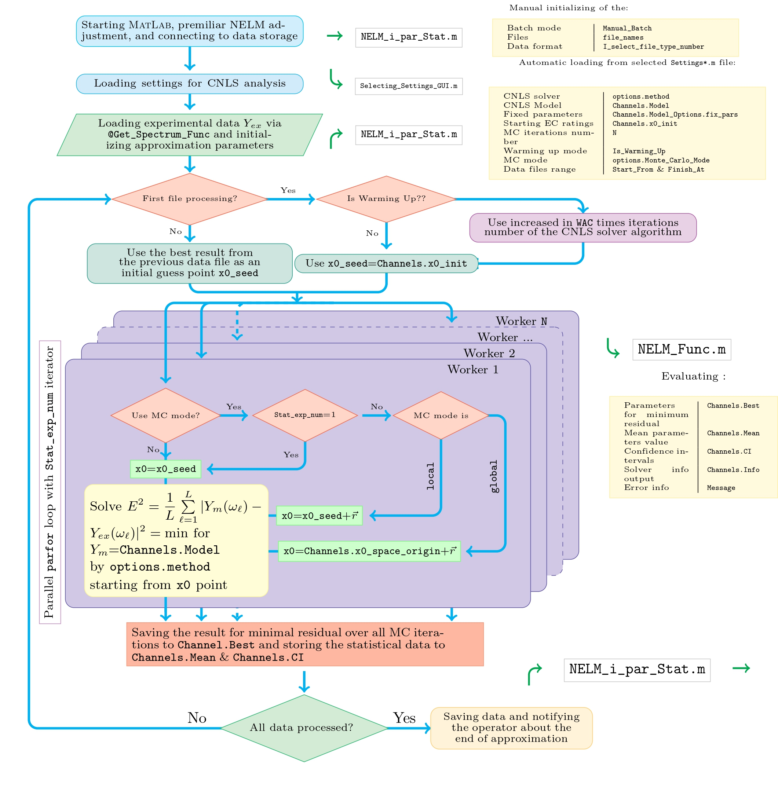

title: 'NELM: modern open-source software for impedance spectroscopy data analysis'
tags:
  - impedance spectroscopy
  - CNLS
  - biosensing
  - data analysis
  - adaptive filtering
  - semiconductor studies
  - equivalent circuit
  - cell research
  - multielectrode array
  - MatLab
  - GNU Octave
authors:
  - name: Natalia A. Boitsova
    orcid: 0009-0006-2524-7618
    corresponding: true
    equal-contrib: true
    affiliation: 1
  - name: Anna A. Abelit
    orcid: 0000-0003-3859-6981
    equal-contrib: true
    affiliation: 1
  - name: Daniil D. Stupin
    orcid: 0000-0002-5470-9301
    equal-contrib: true
    affiliation: 1
 
affiliations:
 - name: Alferov University, St. Petersburg, Russia;
   index: 1
date: 11 September 2025
bibliography: paper.bib
---

# Summary

Nowadays, electrical impedance spectroscopy (EIS) has become a cutting-edge experimental technique with a wide range of applications, from simple passive circuits diagnostics to semiconductor high-end device development and breakthrough technologies in biosensing. Although EIS hardware is well developed today, EIS analysis software is mostly custom, old fashioned, *i.e.* limited in functionality, does not take advantage of modern computer science and hardware advances, and is usually implemented in  close-source code or written in outdated programming languages, which slows down the development of EIS and hinders researchers in developing autonomous EIS-based devices such as implants.

In this paper, we present a free and open source [MatLab/GNU Octave]{.smallcaps} package for EIS analysis, called NELM, which provides powerful tools for matching experimental impedance data with theoretical equivalent circuits. Our software has a user-friendly interface and supports various input data formats, fitting programs and impedance models. In addition, we developed NELM using the latest advances in computing technology, such as symbolic computing, parallel computing and artificial intelligence. The capabilities of NELM have been proven by its application in various fields of science, such as semiconductor research, bioimpedance and electrochemistry, demonstrating the high efficiency of the proposed software package and showing that it is a promising tool for solving current problems in the electronics industry, biosensors and medical technology.

# Statement of need

The earliest known wide-spread software for providing CNLS impedance analysis is the famous LEVM program by J. Ross Macdonald, which is often used today, despite its limitations and the fact that it is technically outdated \cite{LEVM_manual}. 

One of the commonly used today commercial software for EIS is EC-lab by BioLogic (France) [@EC_Lab_manual], which is usually connected to a BioLogic device, allowing users to analyze data in the same program that they used to gather it. This program version 11.50 has a free demo shareware, and it is possible to transfer users' data from outside devices with a function import from ASCII format. This package also operates with a user-friendly interface that constructs equivalent circuits from different elements, but their selection is limited to parallel/series connections, $e.i.$ bridge schemes not supported by EC-Lab. In addition, the schemes in EC-Lab are constructed using lumped elements, and thus not all immittance phenomena can be taken into account during CNLS processing in this package. To be specific, $e.g.$ it is impossible in EC-Lab add to immittance delay exponent multiplier  $e^{-i \omega \tau}$, which appear, in particular, due to the time offset between current and voltage measurements using multichannel ADC or when a non-ideal cable is used  [@naranjo2024smart]. 
In EC-Lab, users can choose a method of approximation from the five provided, regulate the number of iterations, and even use weights, but only as $\mathcal{W}=|Z|^{-1}$. We also found that EC-Lab has performed perfect approximation of model data of RLC circuit, but did not manage to succeed in the case of experimental data, possibly due to the noise and inability to add the mentioned above delay exponent to the model. 

Another example of frequently used software, which deals with CNLS, is commercially available ZView by Scribner Associates Inc. ZView version 4.0 is partly based on LEVM and has a relatively modern, user-friendly graphical interface, and also provides a wide range of EC choosing [@ZView_manual]. It also includes an instant fit feature, which is likely based on the EC algebraic search method. However, since ZView is provided as a Windows executable file with closed source code,  it has lower task flexibility  compared to LEVM,  source code of which can be modified for ongoing impedance research. In addition, unlike LEVM, ZView 4.0 supports batch processing of spectra, which, however, is implemented just in a pipelined manner, $e.g.$ no refinements are used to initialize the CNLS for time series impedance data (cmp. with Sec.~\ref{sec:MC} and [@Boitsova2024MC]).
Unfortunately, ZView has a limitation in visualizing impedance spectra at high resolution (spectrum plots only display 108 data points, possibly due to optimization of video outputs), which makes preliminary analysis of spectra difficult. In contrast, LEVM does not support large, high-resolution spectra. Finally,  EC-Lab, LEVM, and ZView, by default, are not compatible with parallel processing and modern high-speed impedance spectroscopy approaches such as adaptive filtering EIS and Fourier-EIS [@stupin2021bioimpedance].  

In recent years, several custom [@cavallini2019ecis] and open-source programs for processing impedance spectra [@Yrjana2022] have also appeared. In particular, the \textsc{Python} packages are very popular today [@Yrjana2022,@Impedance_py,@Impedance_py_2,@pimpspec,@Py_EIS,ImpedanceAnalyzer,@EIS_Spectrum_Analyser_Z_only,@AutoEIS_article,@AutoEIS_source,@OSIF,@pyZwx_article,@pyZwx_manual,@maghsoudi2018matlab, @murbach2020impedance], however, they, like other open-source products in one combination or another have the same limitations as EC-Lab, Zview and LEVM, $e.g.$ primary parallel/series EC type concept (usage the Circuit Description Code [@boukamp1986nonlinear]), usage of only built-in optimization methods, like \verb!lmfit! \textsc{Python} package, only impedance ($Z$) fitting is released, no hardware acceleration by default, lack of  time-domain EIS support, labor-intensive installation and use, $etc.$

# Process of approximation

General steps, on which NELM software approximation is based, are presented (Fig.~\ref{fig:NELM_sketch}). Firstly, the user is required to select the folder with input data files if flag \verb!Manual_Batch! is set to \verb!true! or select manually the files of interest if flag \verb!Manual_Batch! is set to \verb!false!.

Secondly, the operator, using a graphical interface, selects a settings file, which contains information about the method of data processing, frequency and time ranges, the model for approximation and the initial values of parameters, parameters that can change during the approximation process, and ones that should have fixed values, $etc$.

After user-controlled initialization of the NELM software settings is completed, the computer begins batch CNLS processing of the spectra. Since the best initial approximation for the parameters of the equivalent circuit is not always precisely known, the program can optionally begin with a warming-up mode (if flag \verb!Is_Warming_Up!=1), the purpose of which is to increase the number of iterations by a factor \verb!WUC! to help in more accurately finding the values of the elements of the equivalent circuit for the first measured spectrum. For the remaining spectra, the initial point of approximation can be chosen based on the assumption that during the time between measurements of neighboring spectra the properties of the system under study change insignificantly. This allows us to use the result of the approximation of the $N-1$ spectrum as an initial approximation for the $N$ spectrum. However, at the same time, one should not lose sight of the existence of a situation in which the approximation on the $N-1$ spectrum turns out to be unsuccessful, since in this case, approximations for all subsequent spectra may also fail with a high probability. In order to deal with this problem the \verb!'global'! mode for Monte-Carlo multistart can be chosen (see [@Boitsova2024MC] and Sec.~\ref{sec:MC}).

After successful completion of the approximation process, the program saves the results in the form of a mat-file and notifies the operator about end of its work through the console and a sound signal.

In addition to the scripts described above, the NELM package includes a number of routines that facilitate the processing and analysis of spectra. In particular, such utilities include the \verb!MultiViewGUI! script, which allows the user to visualize both the experimentally measured spectra themselves and their CNLS approximation, script \verb!KK_score.m! for performing the Kramers-Kronig test [@hu1989kramers, @urquidi1990applications],  and a \verb!simplde_DRT.m! --  implementation of the transformation of immittance into a relaxation time distribution [@gavrilyuk2017use].

# Figures

Figures can be included like this:

and referenced from text using \autoref{fig:example}.

Figure sizes can be customized by adding an optional second parameter:
{ width=20% }

# Acknowledgements

The authors are grateful to Kraevskya A.A. for valuable programming advise, Yakovleva L.E., Dubina M.V. for comprehensive assistance and support. This study was carried out with the support of the Ministry of Science and Higher Education (Project № FSRM-2024-0001)

# References

